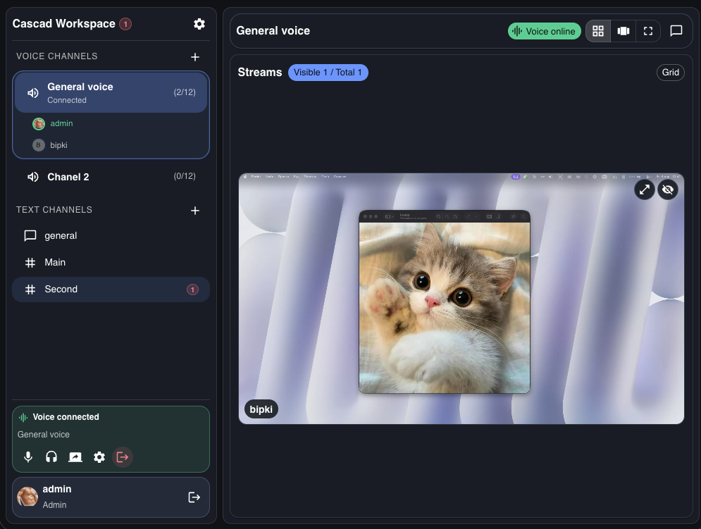

# Cascad

Cascad is a self-hosted team workspace for voice collaboration, text communication, and live screen sharing.
It is designed for real-time sessions where people need to talk, share context instantly, and stay in one shared space.

## Product Demo

## What You Can Do

- Create and manage voice channels inside a workspace
- Share screen streams with selectable quality presets
- Use text channels for asynchronous communication
- See participants, active speakers, and connection status in real time
- Control local audio per participant (mute/volume)
- Join rooms by invite flow with authenticated access

## Why Cascad

- Self-hosted: your infrastructure, your data, your control
- Fast collaboration loop: voice + stream + text in one interface
- Built for small teams and MVP-stage products that need reliable real-time presence

## Documentation

- Technical setup, architecture, API, deploy and tests: [`docs/TECHNICAL.md`](./docs/TECHNICAL.md)
- AI project context: [`AI_CONTEXT.md`](./AI_CONTEXT.md)

## Community Standards

- [License](./LICENSE)
- [Contributing Guide](./CONTRIBUTING)
- [Code of Conduct](./CODE_OF_CONDUCT)
- [Security Policy](./SECURITY)
